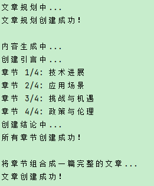
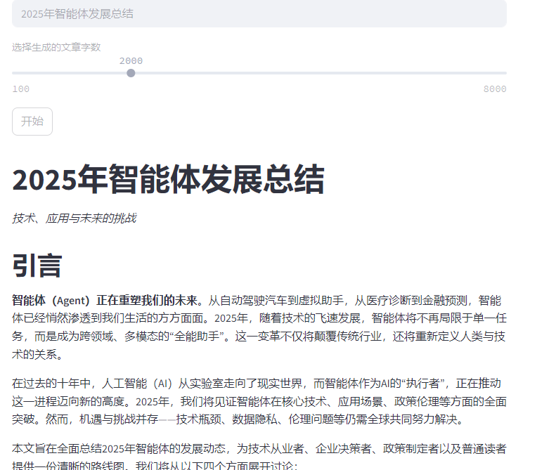
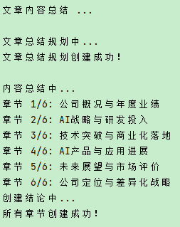
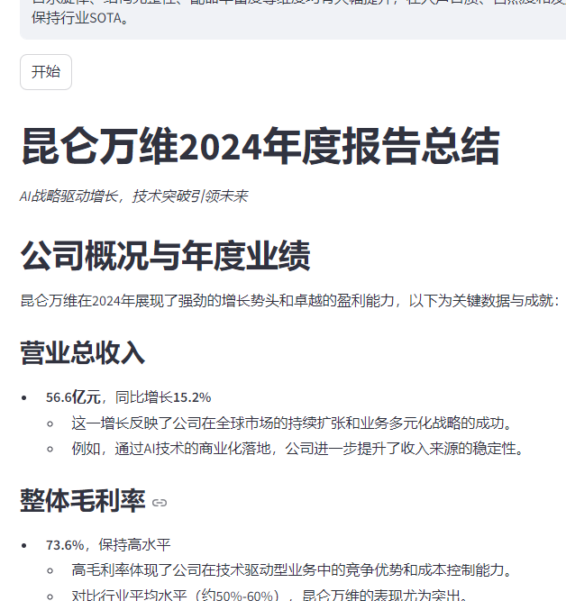

# ai_writer_summary
利用deepseek进行智能写作与文章总结

## Features
智能写作：
- 生成完整的文章，包括引言、正文部分和结论
- 将结果以Markdown形式输出

智能总结：
- 对文章进行总结，输出主要观点，适用于对已知文章的PPT内容生成
- 将结果以Markdown形式输出

## Requirements
需要注册deepseek账号，利用deepseek进行分析与生成
- deepseek相关信息放在.env中

## Usage
web页面利用streamlit，见web_ui.py

```bashI
streamlit run web_ui.py
```

## Images
- 智能写作界面：




- 智能总结界面：


